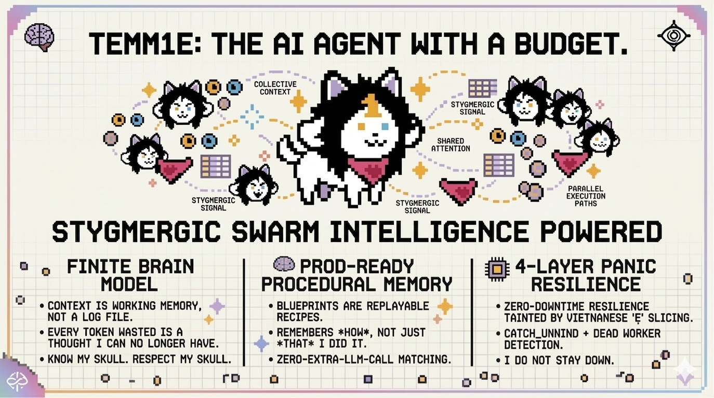

<p align="center">
  
</p>

<p align="center">
  <a href="https://github.com/dawsonblock/Electro/stargazers"></a>&nbsp;
  <a href="https://discord.gg/3ux2c5xz"></a>&nbsp;
  &nbsp;
  &nbsp;
  
</p>

<h3 align="center">
  Cloud-native AI agent runtime, written in Rust.<br>
  <sub>Deploy once. Runs forever. Thinks on a budget.</sub>
</h3>

<p align="center">
  <code>18 crates</code> · <code>1,638 tests</code> · <code>15 MB idle</code> · <code>31ms cold start</code> · <code>9.6 MB binary</code>
</p>

---

## ⚡ Quick Start

```bash
# Interactive TUI — no external services needed
git clone https://github.com/dawsonblock/Electro.git && cd Electro
cargo build --release --features tui
./target/release/electro tui
```

```bash
# Server mode — persistent agent on Telegram / Discord / Slack
cargo build --release
export TELEGRAM_BOT_TOKEN="your-token"
./target/release/electro start
```

> First run launches an arrow-key setup wizard. Paste any supported API key — the provider is detected automatically.

---

## 🧠 How Electro Thinks

Electro is not an LLM wrapper. It is a full **agent runtime** that treats the language model as a **finite brain** with a strict token budget — not an infinite text generator.

```
  You ──▶ CLASSIFY ──▶ Chat? → Single-call reply. Done.
                │
          Order detected
                │
                ▼
          CONTEXT BUILD
          ┌────────────────────┐
          │ System prompt       │
          │ + history           │
          │ + tools             │
          │ + blueprints        │
          │ + λ-Memory          │
          │ ─────────────────── │
          │  Budget: 34K / 200K │
          └────────────────────┘
                │
                ▼
           TOOL LOOP
          ┌────────────────────┐
          │ LLM picks tool     │
          │   → Execute        │
          │   → Verify result  │
          │   → Feed back      │
          │   → Repeat         │
          └────────────────────┘
                │
                ▼
           POST-TASK
           Store memories, extract
           learnings, author blueprints
```

<table>
<tr>
<td width="50%" valign="top">

### 🧮 Finite Brain Model

Every token is a neuron recruited. Every token wasted is a thought the agent can never have. Resources declare their cost upfront. Context rebuilds show a live budget dashboard. Graceful degradation: **full body** → **outline** → **catalog listing**. Never crashes from overflow.

</td>
<td width="50%" valign="top">

### 📜 Blueprints — Procedural Memory

Traditional agents summarize: *"Deployed using Docker."* Useless. Electro creates **Blueprints** — structured, replayable recipes with exact commands, verification steps, and failure modes. Similar tasks replay the recipe. **Zero extra LLM calls** to match.

</td>
</tr>
<tr>
<td width="50%" valign="top">

### 👁️ Vision Browser

Screenshots → LLM vision → `click_at(x, y)` via Chrome DevTools Protocol. Bypasses Shadow DOM, anti-bot protections, dynamic content. Works headless on a $5 VPS. No Selenium. No Playwright. 100+ pre-registered `/login` services with OTK credential isolation.

</td>
<td width="50%" valign="top">

### 🛡️ 4-Layer Panic Resilience

1. `char_indices()` — no invalid UTF-8 slicing
2. `catch_unwind` per message — panics become error replies
3. Dead worker detection — auto-respawn
4. Global panic hook — structured logging

Does not go down quietly. Does not stay down.

</td>
</tr>
</table>

---

## 🔬 Research That Ships

Every cognitive system starts as a theory, gets stress-tested with real models and real conversations, and only ships when the data says it works.

<details>
<summary><strong>λ-Memory — Memory That Fades, Not Disappears</strong></summary>

Exponential decay (`score = importance × e^(−λt)`) but never truly erases. The agent sees old memories at progressively lower fidelity — full text → summary → essence → hash — and can recall any memory by hash.

| Test | λ-Memory | Echo Memory | Naive Summary |
|------|:--------:|:-----------:|:-------------:|
| Single-session (GPT-5.2) | 81.0% | **86.0%** | 65.0% |
| Multi-session (5 sessions) | **95.0%** | 58.8% | 23.8% |

When sessions reset — which is how real users work — λ-Memory achieves **95% recall** where alternatives collapse.

</details>

<details>
<summary><strong>Many Tems — Swarm Intelligence</strong></summary>

Stigmergic swarm: workers coordinate through time-decaying scent signals and a shared SQLite store, not LLM-to-LLM chat. Zero coordination tokens.

| Benchmark | Speedup | Token Cost | Quality |
|-----------|:-------:|:----------:|:-------:|
| 5 parallel subtasks | **4.54x** | 1.01x | Equal |
| 12 independent functions | **5.86x** | **0.30x** | Equal (12/12) |

Quadratic context cost `h̄·m(m+1)/2` becomes linear `m·(S+R̄)`. Enabled by default.

</details>

<details>
<summary><strong>Eigen-Tune — Self-Tuning Distillation</strong></summary>

Every LLM call is a training example being thrown away. Eigen-Tune captures them, scores quality, trains a local model, and graduates it through statistical gates.

| Metric | Result |
|--------|:------:|
| Base (SmolLM2-135M) | 72°F = "150°C" ❌ |
| Fine-tuned (10 convos) | 72°F = "21.2°C" ✅ |
| Pipeline cost | **$0 added LLM cost** |

7-stage pipeline: Collect → Score → Curate → Train → Evaluate → Shadow → Monitor. Statistical gates at every transition.

</details>

---

## 🤖 Supported Providers

Paste any API key — Electro auto-detects the provider:

| Key Pattern | Provider | Default Model |
|:-:|:-:|:-:|
| `sk-ant-*` | Anthropic | claude-sonnet-4-6 |
| `sk-*` | OpenAI | gpt-5.2 |
| `AIzaSy*` | Google Gemini | gemini-3-flash-preview |
| `xai-*` | xAI Grok | grok-4-1-fast-non-reasoning |
| `sk-or-*` | OpenRouter | anthropic/claude-sonnet-4-6 |
| ChatGPT login | **Codex OAuth** | gpt-5.4 |

> **Codex OAuth**: No API key needed. `electro auth login` → log into ChatGPT Plus/Pro → done.

---

## 📡 Channels & Tools

<table>
<tr>
<td width="50%" valign="top">

**Channels**

| Channel | Status |
|---------|:------:|
| **TUI** | ✅ Production |
| Telegram | ✅ Production |
| Discord | ✅ Production |
| Slack | ✅ Production |
| CLI | ✅ Production |

</td>
<td width="50%" valign="top">

**Built-in Tools**

Shell · Vision Browser · Prowl Login · File R/W/List · Web Fetch · Git · Send Message · Send File · Memory CRUD · λ-Recall · Key Management · MCP Management

**14 MCP Servers** in the registry — discovered and installed at runtime

**Vision**: JPEG, PNG, GIF, WebP — graceful fallback on text-only models

</td>
</tr>
</table>

---

## 🏗️ Architecture

18-crate Cargo workspace:

```
electro (binary)
│
├─ electro-core           Shared traits, types, config, errors
├─ electro-agent          Agentic core — λ-Memory, blueprints, DAG execution
├─ electro-hive           Swarm intelligence, pack coordination, scent field
├─ electro-distill        Self-tuning distillation, statistical gates
├─ electro-providers      Anthropic + Gemini + OpenAI-compatible (6 providers)
├─ electro-codex-oauth    ChatGPT Plus/Pro via OAuth PKCE
├─ electro-tui            Interactive terminal UI (ratatui + syntect)
├─ electro-channels       Telegram, Discord, Slack, CLI
├─ electro-memory         SQLite + Markdown + λ-Memory with failover
├─ electro-vault          ChaCha20-Poly1305 encrypted secrets
├─ electro-tools          Shell, browser, file ops, web fetch, git
├─ electro-mcp            MCP client — stdio + HTTP, 14-server registry
├─ electro-gateway        HTTP server, health, dashboard, OAuth
├─ electro-skills         Skill registry
├─ electro-automation     Heartbeat, cron scheduler
├─ electro-observable     OpenTelemetry, 6 predefined metrics
├─ electro-filestore      Local + S3/R2 file storage
└─ electro-test-utils     Test helpers
```

---

## 🔒 Security

| Layer | Protection |
|-------|-----------|
| **Access control** | Deny-by-default. Explicit admin provisioning required. |
| **Workspace isolation** | All file operations sandboxed via `resolve_safe_path`. No path escapes. |
| **Network isolation** | Browser and web_fetch restricted to public web or explicit allowlist. |
| **Secrets at rest** | ChaCha20-Poly1305 vault with `vault://` URI scheme. |
| **Key onboarding** | AES-256-GCM one-time key encryption before transit. |
| **Credential hygiene** | API keys auto-deleted from chat. Secret output filter on replies. |
| **Shell hardening** | Containerized execution. Dangerous patterns and metacharacters blocked. |
| **Git safety** | Force-push blocked by default. |

---

## 📊 Performance

<table>
<tr>
<td align="center"><strong>15 MB</strong><br><sub>Idle RAM</sub></td>
<td align="center"><strong>31 ms</strong><br><sub>Cold start</sub></td>
<td align="center"><strong>9.6 MB</strong><br><sub>Binary size</sub></td>
<td align="center"><strong>1,638</strong><br><sub>Tests</sub></td>
<td align="center"><strong>8</strong><br><sub>AI Providers</sub></td>
<td align="center"><strong>5</strong><br><sub>Channels</sub></td>
</tr>
</table>

| Metric | **Electro** (Rust) | OpenClaw (TypeScript) | ZeroClaw (Rust) |
|--------|:-:|:-:|:-:|
| Idle RAM | **15 MB** | ~1,200 MB | ~4 MB |
| Peak RAM (3-turn) | **17 MB** | ~1,500 MB+ | ~8 MB |
| Binary size | **9.6 MB** | ~800 MB | ~12 MB |
| Cold start | **31 ms** | ~8,000 ms | <10 ms |

> Runs on a $5/month 512 MB VPS where Node.js agents can't even start.

---

## 🛠️ CLI Reference

```bash
electro tui                       # Interactive TUI (--features tui)
electro start                     # Start gateway (foreground or -d for daemon)
electro stop                      # Graceful shutdown
electro chat                      # Basic CLI chat
electro status                    # Show running state
electro update                    # Pull latest + rebuild
electro auth login                # Codex OAuth
electro auth status               # Check token validity
electro config validate           # Validate electro.toml
electro config show               # Print resolved config
electro reset --confirm           # Factory reset with backup
```

**In-chat commands:**

```
/help              Show commands           /model <name>      Switch model
/memory lambda     λ-Memory mode           /memory echo       Echo mode
/keys              List providers          /addkey             Add API key
/usage             Token & cost stats      /mcp               List MCP servers
/login <service>   OTK browser login       /eigentune          Self-tuning status
```

---

## 🧑‍💻 Development

```bash
cargo check --workspace                                              # Quick check
cargo test --workspace                                               # 1,638 tests
cargo clippy --workspace --all-targets --all-features -- -D warnings # 0 warnings
cargo fmt --all                                                      # Format
cargo build --release                                                # Release binary
```

Requires **Rust 1.82+** and Chrome/Chromium (for the browser tool).

---

<details>
<summary><strong>📅 Release Timeline</strong></summary>

```
2026-03-21  v3.2.0  ●━━━ Prowl — web-native browsing, OTK auth, cloned profiles, /login, QR detection
                    │
2026-03-18  v3.1.0  ●━━━ Eigen-Tune — 7-stage distillation, SPRT/CUSUM/Wilson gates, M2 proof
                    │
2026-03-18  v3.0.0  ●━━━ Many Tems — swarm intelligence, 4.54x speedup, zero coordination tokens
                    │
2026-03-16  v2.8.1  ●━━━ Model registry — Gemini 3.1 Flash Lite, Hunter Alpha, GPT-5.4
                    │
2026-03-15  v2.8.0  ●━━━ λ-Memory — exponential decay, hash recall, 95% cross-session accuracy
                    │
2026-03-15  v2.7.0  ●━━━ Interactive TUI — ratatui + syntect, onboarding wizard, slash commands
                    │
2026-03-14  v2.6.0  ●━━━ Vision browser — screenshot→LLM→click_at via CDP
                    │
2026-03-13  v2.5.0  ●━━━ Executable DAG + Blueprint System
                    │
2026-03-11  v2.4.0  ●━━━ Interceptor Phase 1 — real-time task status
                    │
2026-03-11  v2.3.0  ●━━━ Codex OAuth — ChatGPT Plus/Pro as provider
                    │
2026-03-11  v2.2.0  ●━━━ Custom tool authoring + daemon mode
                    │
2026-03-11  v2.1.0  ●━━━ MCP self-extension — 14-server registry
                    │
2026-03-10  v2.0.0  ●━━━ Complexity classification, 12% cheaper, 14% fewer tool calls
                    │
2026-03-10  v1.6.0  ●━━━ Extreme resilience — zero panic paths, dead worker respawn
                    │
2026-03-09  v1.5.0  ●━━━ OTK secure key setup, AES-256-GCM onboarding
                    │
2026-03-09  v1.0.0  ●━━━ First release — 35 features, 905 tests
                    │
2026-03-08  v0.0.1  ●━━━ Architecture scaffold — 13 crates, 12 traits
```

</details>

---

<p align="center">
  <a href="https://discord.gg/3ux2c5xz"></a>
</p>

<p align="center">MIT License</p>
